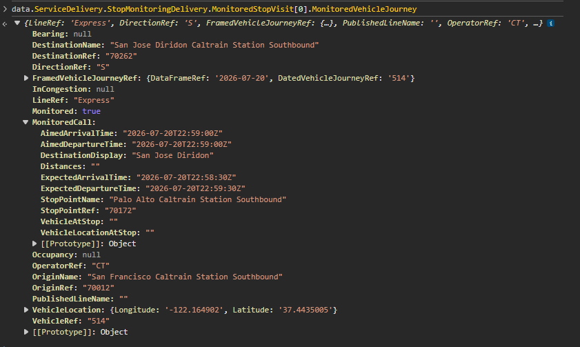

# transit-clone

- This is a transit program that shows you how long it takes for a specific vehicle to reach a stop

# REQUIRED:
- create a .env file, insert a TRANSIT_API_KEY=(enter key here), otherwise it won't work.

# TO-DO:
- Have to work on search improvements.
- Have to implement stop class for easy searches.

Relies on a list of stops, that shows the destination, and how long it takes from the departing location.
- listOfStops = {onestop: {fromThis: time, fromThis: time}, secondStop: {} ... }
