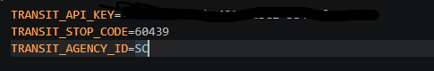

# transit-clone

- This is a transit program that shows you how long it takes for a specific vehicle to reach a stop
- Returns a Stop Instance that contains the id of stop, id of agency, and the list of predictions to that particular stop.

# REQUIRED:
- create a .env file otherwise it won't work.

# TO-DO:
- Have to work on search improvements.

# Required .env file contents:

- Sample: 
- agency id = SC (vta)
- stop code = 60439

# How to Run:
- Make sure that your .env file has all required contents.
- In your terminal, run python server.py
- File can be viewed in http://localhost:8000
- Enjoy!